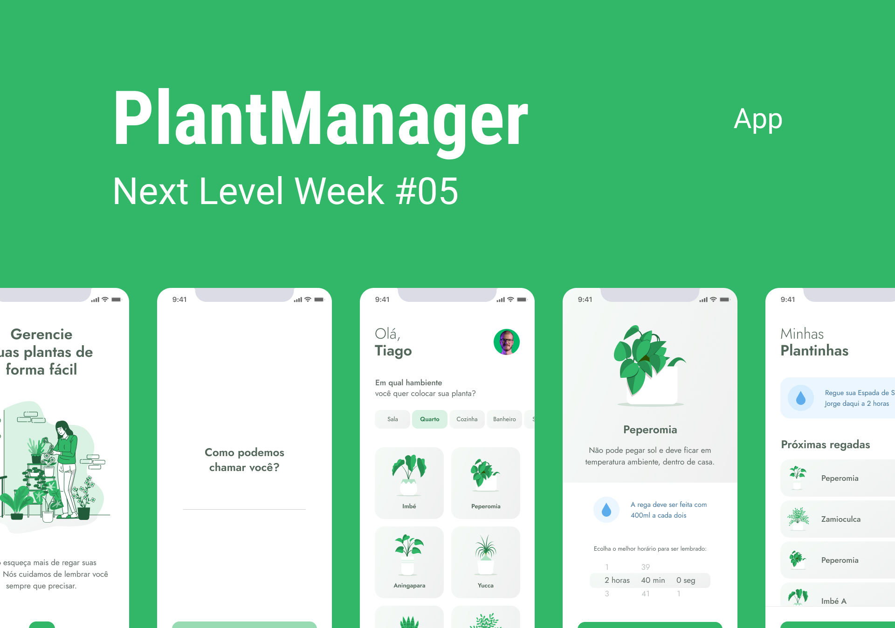

<h1 align="center">
   PlantManager
</h1>

<p align="center">
  <a href="#-tecnologias">Tecnologias</a>&nbsp;&nbsp;&nbsp;|&nbsp;&nbsp;&nbsp;
  <a href="#-projeto">Projeto</a>&nbsp;&nbsp;&nbsp;|&nbsp;&nbsp;&nbsp;
  <a href="#-executar">Executar</a>
</p>

<p align="center">
  
</p>

---

## 🚀 Tecnologias

Esse projeto foi desenvolvido com as seguintes tecnologias:

- [Node.js](https://nodejs.org/pt-br/)
- [React](https://reactjs.org)
- [React Native](https://facebook.github.io/react-native/)
- [Expo](https://expo.io/)
- [TypeScript](https://www.typescriptlang.org/)

---

## 🌱 Projeto

O PlantManager é uma aplicação que vai te ajudar a lembrar a hora de regar suas plantinhas.

[Layout do Projeto](<https://www.figma.com/file/fGJEBtzP6Su9ZvyjJYiimh/PlantManager-(Copy)?node-id=0%3A1>)

---

## 📱 Executar

1. Clone o projeto e instale suas dependências:

```bash
git clone https://github.com/MatheusPalinkas/PlantManager.git
cd plantmanager
yarn install
```

2. Inicie o expo:

```bash
yarn start
```

3. Abra mais uma aba do terminal e navegate até a pasta do projeto e execute o json-serve:

```bash
npx json-server .\src\services\server.json --host 192.168.0.104 --port 3333
```
